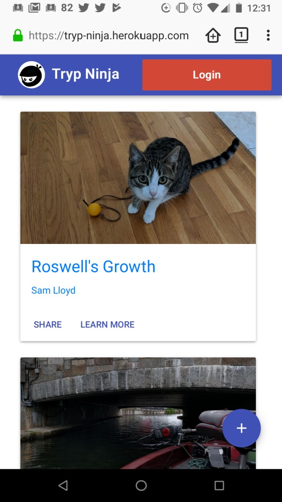
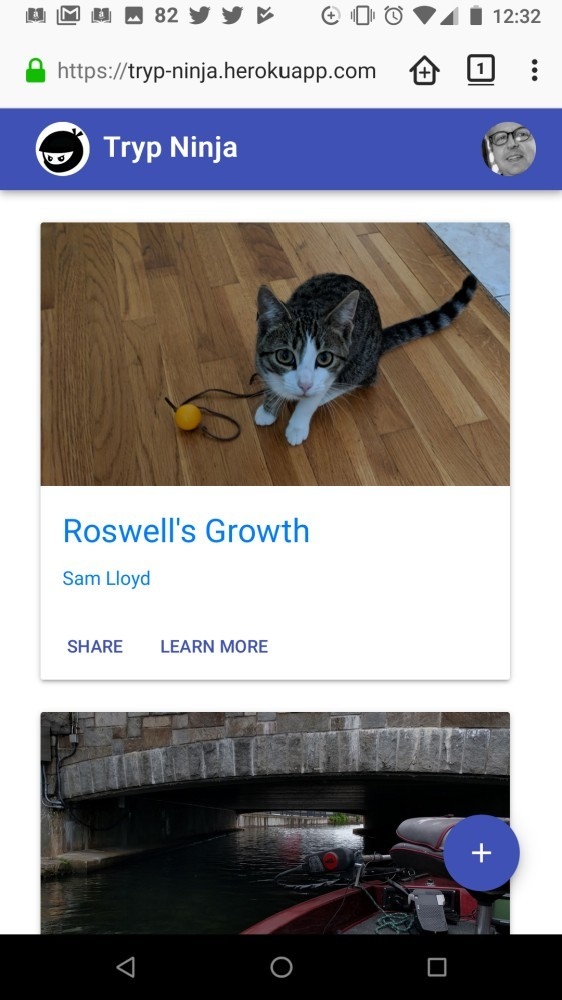
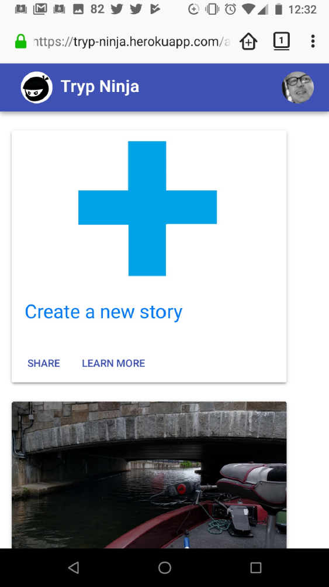
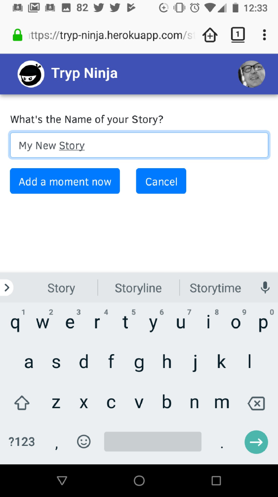
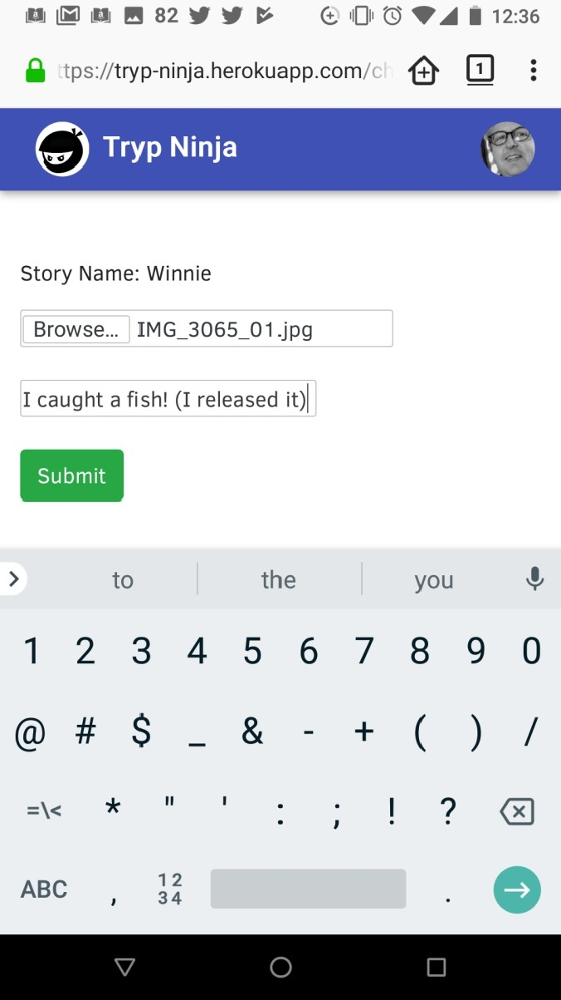
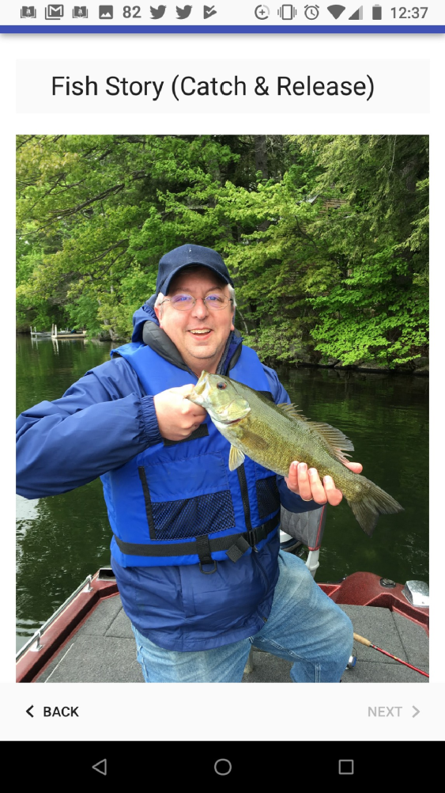

# TrypNinja   

  

### Description

<strong>TrypNinja</strong> is an application which allows the user to create a story from a mobile device. Once logged into the application, the user can either return to a story previously started or begin a new story. The user is offered the option to enter a text item or a photo. When the user selects to add a photo, the application will call up the camera, the user snaps a photo, and the application adds the photo to the story.

#### Technologies Used:

This application has been built as a full-stack application. The `React` framework was used to render a dynamic front-end. The back-end utilizes `Node` and a `MySQL` database for housing user accounts and their stories. The application makes use of `express` for middleware and `Sequelize` as an ORM for the database. Images are stored using the `Amazon S3 service`.
 
### The Need Our App Fills

<strong>TrypNinja</strong> fills the gap in existing social media sites by allowing users to create a COMPLETE story and publishing it for others to see.  Stories are comprised photos and text.

### How to Use the App

1. <strong>Step 1:</strong> Open the application
* Navigate to https://tryp-ninja.herokuapp.com/

2. <strong>Step 2:</strong> Login with your `Google` account

3. <strong>Step 3:</strong> View a story
* Scroll through the available stories, click on the one you would like to view 

* Scroll through the story swiping left and right or by using the `next` and `back` buttons

4. <strong>Step 4:</strong> Start a new story by clicking on the `plus` button or add to an open story by clicking on the story button.

5.<strong>Step 5:</strong> Name your story.

6.<strong>Step 6:</strong> Add a moment to your story
* Click on the `Add a moment now` button
* Click on the `Browse` button
* Click on the camera icon
* Once your camera is open, take a photo and click on the check-mark button
* Click the green submit button

### Potential Future Features

* `Friends` – this concept would allow people to share stories ONLY with their own friends or make their stories “public”.  Conversely, they would have the option of only seeing stories from friends.  For now all stories are Public.
* `User Profile` – this would be a screen that would allow the user to see their own complete stories and in-progress stories (and delete them).  They could also add personal info, like insta and snap links.
* `Share on Facebook`.  This feature is the best chance of this getting wide use.  If a user shared their story on Facebook, for example, we would post a message to their Facebook account with a link to their story.  A new person would need to log in to see their story.  

